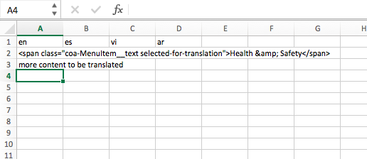

# Translation Workflow (Let's Iterate!)

This document details how the html for Janis can be downloaded and highlighted to send to translators. This process will also generate a .csv file for translations to be added to, if desired. The intent is to trial a translation workflow and identify opportunities for improvement and then to iterate. 

### Requirements: 

This workflow has only been tested in Chrome using the Chrome extensions 
[Single File](https://chrome.google.com/webstore/detail/singlefile/mpiodijhokgodhhofbcjdecpffjipkle?hl=en)
and it's dependency [Single File Core](https://chrome.google.com/webstore/detail/singlefile-core/jemlklgaibiijojffihnhieihhagocma?hl=en). 

To begin, click the links and then click the 'add to chrome' button to install both. 
Once installed, you'll see the Single File Icon  to the right of your browser location bar.

### Steps:

#### 1. Navigate to the page you'd like to download and highlight for translations.
In this sample, I'll use the [Curbside Compost Pickup Page](http://alpha.austin.gov/services/compost-pickup)
It may be helpful to select the language you're sending to your translator so the non-translated content is more obvious.

#### 2. Download the page 
You'll click the Single File icon in your browser bar and wait a few minutes. 
Then click the link labeled *Click here to save the page* which should show in a yellow-ish bar. 


  
### If you don't require highlighting, your process ends here. 
Try loading the page you've downloaded in a browser to ensure the page renders as expected.
**Remember, this page will not have any javascript functionality** (menus and forms will likely be inoperable, but most links will work).
Once you've verified everything looks as expected, you can email or send this file as you would any other. Also, feel free to rename the file to something more user friendly.

### Continue, if you require highlighting. 

#### 3. Add code to page to allow highlighting
Open your downloaded file in a text editor. I use SublimeText, but you can use any text editing application (TextEdit or Notepad are default applications for Macs and PCs respectively) that your computer may have.

Paste the code below at the bottom of your file, and then save your file. 

Note, I am not proud of this code. Do not write code like this for your own well-being and for preservation of your friendships.

```
<style type="text/css">
.selected-for-translation{background-color: #ffff0066 !important}
#selected-for-translation-DONE{
  left: 10px;
  margin: 0;
  position: fixed;
  top: 10px;
  z-index: 999;
}
</style>
<script>
const CSS_CLASS = 'selected-for-translation';
const FILENAME_PREFIX = 'for-translations-'+ new Date().getTime();

function download(content, filename, type) {
  const url = window.URL.createObjectURL(new Blob([content.join('')], {type: type}));
  const a = window.document.createElement('a');
  a.href = url;
  a.download = filename;
  a.click();
  window.URL.revokeObjectURL(url);
}

function js_downloads(element, index) {
  const content = ['document.write(`\n<!-- COPY START HERE -->\n', element.outerHTML, '\n<!-- COPY TO HERE -->\n`);'].join('');

  download(content, FILENAME_PREFIX + '-c-' + index + '.js','text/javascript');
  
  const script = document.createElement('script');
  script.setAttribute('type', 'text/javascript');
  script.setAttribute('src', FILENAME_PREFIX + '-c-'+index+'.js');
  element.parentNode.replaceChild(script, element)
}

function clean_document_download() {
  const content = []
  const lang = document.documentElement.getAttribute('lang');
  const head = document.head.outerHTML
    .replace(/<script\b[^<]*(?:(?!<\/script>)<[^<]*)*<\/script>/gi, '')
    .replace(/<link rel="preload" as="(script|style)" href="[A-Za-z0-9\-\./]*\.(js|css)">/gi, '');
  const button = document.getElementById(CSS_CLASS + '-DONE');
  button.parentNode.removeChild(button);
  const body = document.body.outerHTML
    .replace(/<script\b[^<]*(?:(?!<\/script>)<[^<]*)*<\/script>/gi, '');
  content.push('<!DOCTYPE html><html lang="' + lang + '">', head, body, '</html>');

  download(content, FILENAME_PREFIX + '-index.html', 'text/html');
}

function add_section_highlighter() {
  document.body.onclick = function(e) {
    e.preventDefault();
    if(e.target.classList.contains(CSS_CLASS)) {
      var shouldDeselect = window.confirm('Unhighlight this section?');
      if(shouldDeselect) e.target.classList.remove(CSS_CLASS);
    } else {
      e.target.classList.add(CSS_CLASS);
      setTimeout(function(){
        var shouldSelect = window.confirm('Highlight this section?');
        if(!shouldSelect)  e.target.classList.remove(CSS_CLASS);
      }, 200);
    }
  };
}

function add_file_builder() {
  const a = document.createElement('a');
  a.setAttribute('id', CSS_CLASS + '-DONE');
  a.setAttribute('class', 'usa-button usa-button-big');
  a.innerHTML = 'Translations Selected';
  a.onclick = function(e) {
    e.preventDefault();
    e.stopPropagation();
    let content = ["en,es,vi,ar\n"];
    els = document.getElementsByClassName(CSS_CLASS);
    Array.prototype.forEach.call(els, function(el, index) {
      content = content.concat(['"'+el.outerHTML.replace(/"/g,'""')+'",,,\n']);
      //js_downloads(el, index, FILENAME_PREFIX);
    });
    download(content, FILENAME_PREFIX + '.csv', 'text/csv');
    clean_document_download();
  }
  document.body.appendChild(a);
}

document.addEventListener("DOMContentLoaded", function(event) { 
  add_file_builder();
  add_section_highlighter();
});
</script>
```

#### 4. Open your saved file in Chrome
You should see a button at the top right that that reads *Translations Selected*

#### 5. Highlight translations and download csv
You can now click on items within the page to highlight them. This will indicate what sections need to be translated.
As you click on items, you'll see a prompt which asks if you're sure about your selection. You may click an item to deselect it as well. 

Once you've completed making selections, click the *Translations Selected* button. This will begin a download of two files. Your browser may ask for your permission to download multiple files. If so, click ok.

Your files will be named something similar to **for-translations-1525922959252-index.html** and **for-translations-1525922959252.csv**


#### 6. Review Files
Try loading the new page you've downloaded in a browser to ensure the page renders as expected. It should have the content you selected previously highlighted in yellow and should no longer contain the *Translations Selected* button. Remember, this page will not have any javascript functionality (menus and forms will likely be inoperable, but most links will work). 

Try opening the csv in Excel or another spreadsheet application. It should show your selected content to be translated in the left column under the 'en' heading. The columns for 'es', 'vi', and 'ar' should be empty for translators to add to.

#### 7. Add to csv file
If you have additional content to be translated which does not show up on the site, you may add that content directly to your csv. 



#### 8. Send file
Once you've verified everything looks as expected, you can email or send these files as you would any other. Also, feel free to rename the files to something more user friendly.


